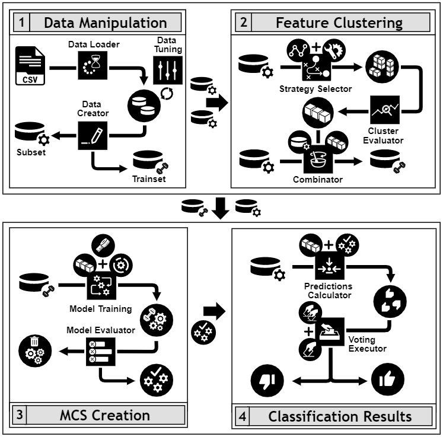

---
output:
  github_document: default
editor_options: 
  chunk_output_type: console
---
[](https://travis-ci.com/drordas/D2MCS)
[](https://www.tidyverse.org/lifecycle/#maturing)
[](https://codecov.io/gh/drordas/D2MCS)

# Data Driving Multiple Classifier System

<div style = "text-align: justify">
D2MCS provides a novel framework to able to automatically develop and deploy an accurate Multiple Classifier System (MCS) based on the feature-clustering distribution achieved from an input dataset. D2MCS was developed focused on four main aspects: (i) the ability to determine an effective method to evaluate the independence of features, (ii) the identification of the optimal number of feature clusters, (iii) the training and tuning of ML models and (iv) the execution of voting schemes to combine the outputs of each classifier comprising the MCS.
</div>

## Description 📄

The D2MCS architecture is based on the interaction of four components associated with each phase of the process for the building the MCS and its operation. As show in Figure 1, it is possible to appreciate the different steps followed to carry out each stage.

The tool starts with the use of data in CSV format to obtain the *Subset* and *Trainset* structures necessary to be the input for the successive tasks (first component). The first structure is designed to discover the best distribution of features through the selected clustering strategy (second component) and is used to perform the prediction of the included data through different types of voting systems (fourth component). On the other hand, the *Trainset* structure, obtained directly from the initial dataset or as an output of the clustering technique used, contains the data and the groups of features selected to build the SMC with the best possible performance (third component).



*Figure 1. D2MCS workflow operation diagram.*

## Pre-requisites 📋

#### Required software

  - **R (\>= 4.0)**

#### Required libraries

  - **Imports**:
  
|         | R Libraries |              |           |
|:-------:|:-----------:|:------------:|:---------:|
| caret   | devtools    | dplyr        | FSelector |
| ggplot2 | ggrepel     | gridExtra    | infotheo  |
| mccr    | mltools     | ModelMetrics | questionr |
| R6      | recipes     | tictoc       | varhandle |

  - **Suggests**:

| R Libraries |       |           |                     |
|:-----------:|:-----:|:---------:|:-------------------:|
| grDevices   | knitr | rmarkdown | testthat (>= 3.0.2) |

## Installation 🔧 

#### Install the development version from GitHub:

``` r
devtools::install_github('drordas/D2MCS')
library(D2MCS)
```

It should be taken into account that the case of needing all the dependencies, the parameter *dependencies = TRUE* should be included in the command *install_github*.

## Build with 🛠️

  - [RStudio](https://www.rstudio.com/) 
    - The programming environment was used.
  - [roxygen2](https://CRAN.R-project.org/package=roxygen2)
    - Uses to generate the documentation.
  - [testthat](https://CRAN.R-project.org/package=testthat)
    - Uses to implement automatic test.

## Version 📌

We use [SemVer](http://semver.org/) for versioning. For all available versions, look at the [tags in this repository](https://github.com/drordas/D2MCS/tags).

## Citation ✍

To cite **D2MCS** please use:

> Ruano-Ordás, D; Yevseyeva, I, Basto-Fernandes,V; Méndez, José R; Emmerichc, Michael T.M. (2018). 
> Improving the drug discovery process by using multiple classifier systems
> Expert Systems with Applications. Volume 121, pp. 292-303.
> Elsevier. https://doi.org/10.1016/j.eswa.2018.12.032

> Ruano-Ordás, D., Burggraaff, L., Liu, R. et al.
> A multiple classifier system identifies novel cannabinoid CB2 receptor ligands.
> J Cheminform 11, 66 (2019). 
> https://doi.org/10.1186/s13321-019-0389-9

## Authors ✒️

  - **Miguel Ferreiro Díaz** - *Developer* - [miferreiro](https://github.com/miferreiro)
  - **David Ruano Ordás** - *Project Manager and developer* - [drordas](https://github.com/drordas)
  - **José Ramón Méndez Reboredo** - *Project Manager* - [moncho-mendez](https://github.com/moncho-mendez)

## Licence ⚖

This project is under the License GPL-3.
